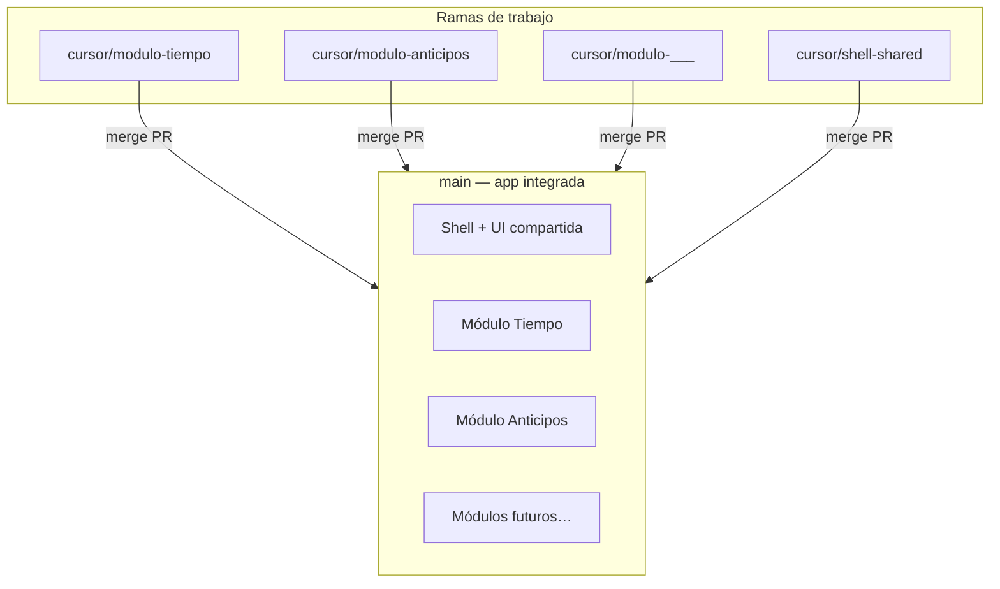

# Módulos y ramas Git — HMV Portal

Este repo es **una sola app Next.js**. `main` siempre debe poder correr completa. Las ramas por módulo sirven para **desarrollar y revisar con lupa** un flujo de negocio antes de integrarlo.

## Modelo en una imagen



## Regla de oro

| Rama | Qué es |
|------|--------|
| **`main`** | La verdad integrada. `npm run dev` con **todos** los módulos que ya entraron. |
| **`cursor/modulo-*`** | Trabajo focalizado. Merge a `main` cuando el módulo (o par empleado+gerente) esté listo. |
| **`cursor/shell-shared`** | Cambios que afectan a **todos** (Button, breadcrumb, sidebar, tokens). |

No mantengas ramas de módulo meses sin merge: se desincronizan en archivos compartidos.

---

## Catálogo de módulos

Cada **dominio** = ruta empleado + ruta gerente + datos + (opcional) BD.

| ID | Rama Git | Empleado | Gerente | Datos / BD | Estado |
|----|----------|----------|---------|------------|--------|
| **tiempo** | `cursor/modulo-tiempo` | `/hoja-tiempo` | `/aprobacion-tiempo` | `prisma` + `src/server/mi-tiempo-actions.ts` | BD SQLite activa |
| **anticipos** | `cursor/modulo-anticipos` | `/mis-anticipos` | `/aprobacion-anticipos` | `src/lib/*anticipos*` (mock → BD después) | Mock |
| **modulo-3** | `cursor/modulo-{nombre}` | `/…` | `/aprobacion-…` | `src/lib/{nombre}-mock.ts` | Por definir |
| **modulo-4** | `cursor/modulo-{nombre}` | … | … | … | Por definir |
| **modulo-5** | `cursor/modulo-{nombre}` | … | … | … | Por definir |

Renombra `modulo-3…` cuando tengáis el nombre de negocio (ej. `cursor/modulo-viaticos`).

---

## Qué archivos “pertenece” a cada módulo

### Módulo **tiempo** (`cursor/modulo-tiempo`)

```
src/app/hoja-tiempo/
src/app/aprobacion-tiempo/
src/server/mi-tiempo-actions.ts
src/lib/mi-tiempo-mock.ts
src/lib/aprobacion-tiempo-mock.ts
src/lib/aprobacion-filtros.ts
src/lib/registro-tiempo-db.ts
src/lib/tiempo-bridge.ts          ← sync empleado ↔ gerente
prisma/schema.prisma              ← solo tablas de tiempo (por ahora)
prisma/seed.ts
```

### Módulo **anticipos** (`cursor/modulo-anticipos`)

```
src/app/mis-anticipos/
src/app/aprobacion-anticipos/
src/lib/mis-anticipos-mock.ts
src/lib/aprobacion-anticipos-mock.ts
src/lib/anticipos-filtros.ts
src/lib/aprobacion-anticipos-filtros.ts
.cursor/rules/30-anticipos-business.mdc
```

### **Shell / compartido** (`cursor/shell-shared`)

```
src/app/layout.tsx
src/app/page.tsx
src/app/globals.css
src/components/layout/
src/components/ui/                 ← Button, PageBreadcrumb, DataTable…
src/components/ui/AppProviders.tsx  ← badges nav + sync cross-módulo
.cursor/rules/00-module-structure.mdc
.cursor/rules/02-design-system.mdc
```

Si tocás algo en `shell-shared`, **avisa** en el PR porque impacta todos los módulos.

---

## Patrones que se repiten (plantilla módulo nuevo)

1. **Empleado:** `{Modulo}View` → lista | detalle | form  
2. **Gerente:** aprobación con tabs Pendientes / Resueltas, Perfil A tabla + filtros  
3. **Datos:** `src/lib/{modulo}-mock.ts` → luego Prisma + `src/server/{modulo}-actions.ts`  
4. **Filtros:** `src/lib/{modulo}-filtros.ts` (Perfil A)  
5. **Entrelazado:** si gerente muta estado visible al empleado → puente en `AppProviders` (como `tiempo-bridge.ts`)

Checklist nuevo módulo:

- [ ] Rutas en `Sidebar` + badges si hay pendientes  
- [ ] `RoleRouteGuard` en páginas gerente  
- [ ] Misma jerarquía de botones y `PageBreadcrumb`  
- [ ] Rama `cursor/modulo-{nombre}` creada desde `main`  
- [ ] Merge a `main` cuando el par empleado+gerente corre junto  

---

## Flujo de trabajo diario

### Trabajar solo en Tiempo

```bash
git checkout main
git pull                    # cuando tengáis remoto
git checkout cursor/modulo-tiempo
git merge main                # traer integración reciente
# … editar archivos del módulo tiempo …
git add …
git commit -m "…"
git checkout main
git merge cursor/modulo-tiempo
npm run dev                   # probar app completa
```

### Trabajar solo en Anticipos

Igual con `cursor/modulo-anticipos`.

### Cambiar botones / layout para todos

```bash
git checkout cursor/shell-shared
# … Button, Sidebar, tokens …
git checkout main && git merge cursor/shell-shared
```

---

## BD vs UI (recordatorio)

| Cambio | Dónde se guarda |
|--------|------------------|
| Pantalla, CSS, componente | Archivos en `src/` (Git) |
| Registro de horas (Mi Tiempo) | `prisma/dev.db` (local, no se commitea) |
| Anticipos (hoy) | Mock en memoria / archivos `.ts` |

---

## Comandos útiles

```bash
git branch -a                 # ver ramas
git checkout cursor/modulo-tiempo
npm run dev
npm run db:migrate && npm run db:seed   # solo módulo tiempo
```

---

## Remoto (GitHub) — cuando lo conectéis

```bash
git remote add origin https://github.com/ORG/hoja-tiempo.git
git push -u origin main
git push -u origin cursor/modulo-tiempo
git push -u origin cursor/modulo-anticipos
git push -u origin cursor/shell-shared
```

Hasta entonces, **todo queda solo en tu Mac** en `.git/`.
