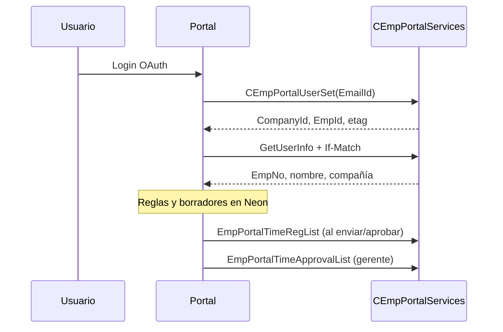

# IFS — CEmpPortalServices (Hoja de tiempo)

Contrato OpenAPI versionado en este repo para el módulo **Mi Tiempo** y **Aprobación de tiempo**.

## Servicio

| Campo | Valor |
|-------|--------|
| **Proyección** | `CEmpPortalServices` |
| **Canal** | `/int/` (integraciones) |
| **Base URL (dev)** | `https://hmvdev.ifs360.cloud/int/ifsapplications/projection/v1/CEmpPortalServices.svc` |
| **OpenAPI local** | [`CEmpPortalServices.openapi.json`](./CEmpPortalServices.openapi.json) |
| **OpenAPI en vivo** | `…/CEmpPortalServices.svc/$openapi?V3` (requiere Bearer) |
| **Auth** | OpenID — realm `hmvdev` |

## Operaciones usadas por el portal

| Flujo | Operación OData | Cuándo |
|-------|-----------------|--------|
| Sesión | `GET CEmpPortalUserSet(EmailId='…')` | Tras login OAuth → `CompanyId`, `EmpId`, `@odata.etag` |
| Perfil | `GetUserInfo()` | Inicio de sesión / header del portal |
| Tope diario | `GetHoursSummary()` → `EmployeeSchedule[].ScheduleHours` | Validación por día (reemplaza 8.5h fijo) |
| Corte | `GetCutOffdate(...)` | Antes de guardar/enviar |
| Catálogo P/S/A | `GetValidEmpPrjAct(AccountDate=…)` | Modal de registro |
| Códigos reporte | `GetValidActReportCode(...)` | Al elegir actividad |
| Leer empleado | `GetEmployeeTimesheet()` | Vista día / historial |
| Pendientes gerente | `GetApprovalTimesheets()` | Bandeja de aprobación |
| Alta | `POST EmpPortalTimeRegList` | Consolidar registros limpios |
| Edición | `POST EmpPortalTimeUpdateList` | Correcciones |
| Baja | `POST EmpPortalTimeDeleteList` | Eliminar en IFS |
| Aprobar/rechazar | `POST EmpPortalTimeApprovalList` | Gerente confirma |

Todas las acciones POST requieren header **`If-Match`** con el `@odata.etag` de `CEmpPortalUserSet`.

## Payload de registro (`EmpPortalTimeRegList`)

```json
{
  "EmpTimeReg": [
    {
      "AccountDate": "2026-07-22",
      "ShortName": "PROY-001",
      "ReportCostCode": "DN",
      "DayHours": 4,
      "Comments": "opcional"
    }
  ]
}
```

## Flujo portal ↔ IFS



**Pendiente confirmar con IFS:** ¿POST al **Enviar a aprobación** del empleado o solo cuando el **gerente aprueba**? Valores válidos de `Event` en `EmpPortalTimeApprovalList`.

## Actualizar el OpenAPI

```bash
curl -H "Authorization: Bearer <token>" \
  "https://hmvdev.ifs360.cloud/int/ifsapplications/projection/v1/CEmpPortalServices.svc/\$openapi?V3" \
  -o docs/ifs/CEmpPortalServices.openapi.json
```

## Cliente TypeScript

Implementación en [`src/lib/ifs/`](../../src/lib/ifs/):

- `config.ts` — URLs y variables de entorno
- `client.ts` — fetch OData + manejo de errores
- `cemp-portal.ts` — sesión (`If-Match`) y wrappers de las ~11 operaciones
- `types.ts` — tipos derivados del OpenAPI

Variables en `.env.local` (ver `.env.example`).

## APIs descartadas (por ahora)

| Servicio | Motivo |
|----------|--------|
| `UserProfileService` (`/main/`) | Preferencias Aurena, no portal |
| `UserSettings` (`/b2b/`) | Contexto B2B |
| `CEmpBulkTimeApprovalHandling` | Cierre masivo por periodo |
| `TimeClockService` | Reloj checador |
| `EmployeeAbsenceDataService` | Ausencias (fase posterior) |

---

## Autenticación — lo que probamos en DEV

Hay **dos credenciales distintas**; no son intercambiables:

| Credencial | Para qué sirve | ¿Llama `CEmpPortalServices`? |
|------------|----------------|------------------------------|
| **`IFS_IDCS_*` en `.env.local`** | Integración M2M (Oracle IDCS) | Token OK, pero API responde **401** — falta permiso/audience en IFS |
| **Login Aurena (IFS Cloud web)** | Administrar IFS en navegador | Con sesión web, la API responde **200** |

### Token M2M (IDCS)

- Token URL: `{IFS_IDCS_DOMAIN_URL}/oauth2/v1/token`
- Scope que funciona: `urn:opc:idm:__myscopes__`
- Lee `IFS_IDCS_CLIENT_ID` / `IFS_IDCS_CLIENT_SECRET`

### Login web (Aurena)

- URL empleado: `https://hmvdev.ifs360.cloud/main/ifsapplications/web/`
- OAuth client del navegador: `IFS_aurena`
- Realm: `hmvdev`

### Empleados del portal (`CEmpPortalUserSet`)

En DEV hay **~1400 usuarios** con `EmailId` corporativo (`*@h-mv.com`). Ejemplo probado:

| EmailId | CompanyId | EmpNo | Nombre |
|---------|-----------|-------|--------|
| `jjimenez@h-mv.com` | HMVINGCO | 71713599 | Juan Carlos Jimenez Martinez |

El portal debe autenticar al empleado con OAuth y usar su **email = EmailId** en `CEmpPortalUserSet`.

### Próximo paso técnico

Implementar **OAuth authorization code** en Next.js (login empleado → Bearer token → `openCempPortalSession(email)`), o pedir a TI que el client IDCS tenga acceso explícito a `/int/.../CEmpPortalServices`.

```bash
npx tsx scripts/ifs-smoke-test.ts jjimenez@h-mv.com
```

*(El smoke test con IDCS M2M seguirá en 401 hasta que TI habilite la API.)*

---

## Solicitud a IFS (plantilla)

Copiar y enviar al equipo IFS / integraciones:

---

**Asunto:** Portal empleados HMV — OAuth + usuarios de prueba para `CEmpPortalServices`

Hola,

Estamos integrando el **Portal de empleados HMV** (módulo Hoja de tiempo) con la proyección OData:

`https://hmvdev.ifs360.cloud/int/ifsapplications/projection/v1/CEmpPortalServices.svc`

Necesitamos lo siguiente para el ambiente **dev (`hmvdev`)**:

### 1. Cliente OAuth (OpenID)

- `client_id` y `client_secret` (si aplica confidential client)
- **Redirect URIs** autorizadas (dev local + staging cuando exista)
- **Scopes** necesarios para consumir APIs OData en `/int/`
- Confirmación del **token endpoint** del realm `hmvdev`

### 2. Usuarios en `CEmpPortalUserSet`

Alta de **dos usuarios de prueba**:

| Rol | Uso | EmailId esperado |
|-----|-----|------------------|
| Empleado | Registrar horas en Mi Tiempo | _(correo OAuth del empleado de prueba)_ |
| Gerente | Aprobar/rechazar en bandeja | _(correo OAuth del gerente de prueba)_ |

Confirmar que **`EmailId` = email del token OAuth** (claim `email` o equivalente).

### 3. Dudas de negocio / contrato

1. ¿En qué momento debemos invocar **`EmpPortalTimeRegList`**: al **enviar a aprobación** del empleado o solo cuando el **gerente aprueba**?
2. Valores permitidos del campo **`Event`** en **`EmpPortalTimeApprovalList`** (aprobar vs rechazar).
3. Ejemplo de respuesta real de **`GetEmployeeTimesheet`** y **`GetApprovalTimesheets`** para mapear estados del portal.
4. ¿Hay ambiente de **staging** distinto de `hmvdev` para UAT?

Quedamos atentos. Gracias.

---
